# import local repository

Example in:
- importLocalRepo
- demo

## create standard java library

run package to create library

the output in target folder

## import standard java library to target project

copy the lib jar file to /lib folder

config in pom to import

get groupId, artifactId, version from pom of importLocalRepo

now we can import and use package of importLocalRepo

different between 2 `jar` file

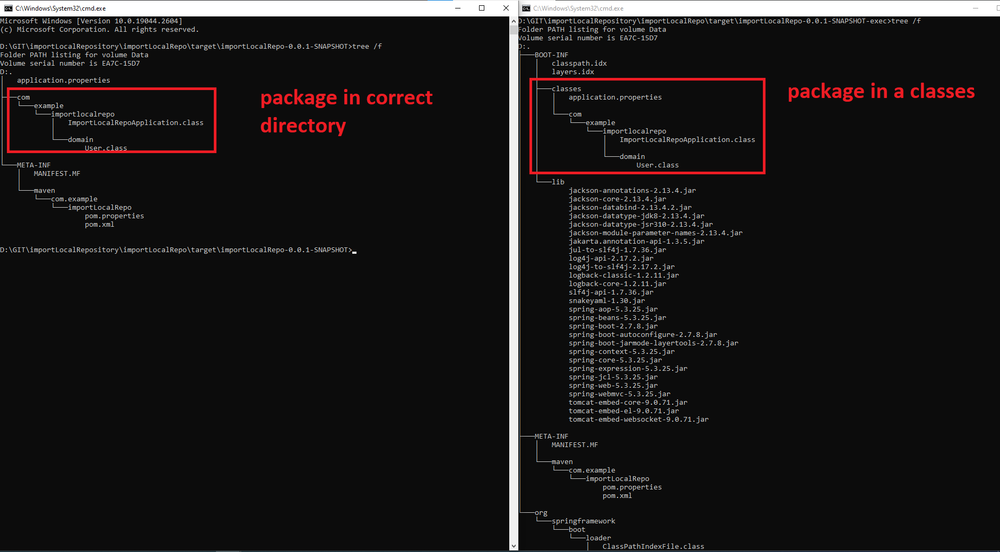

# import repository by maven from NEXUS

Example in:
- importNexusServer
- demo

install nexus on docker

    docker pull sonatype/nexus3

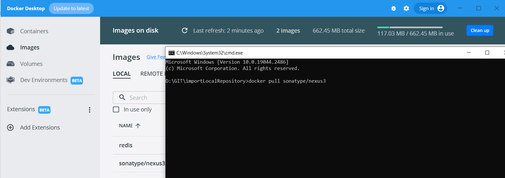

**run on cmd**

    docker run -d -p 8081:8081 --name nexus sonatype/nexus3

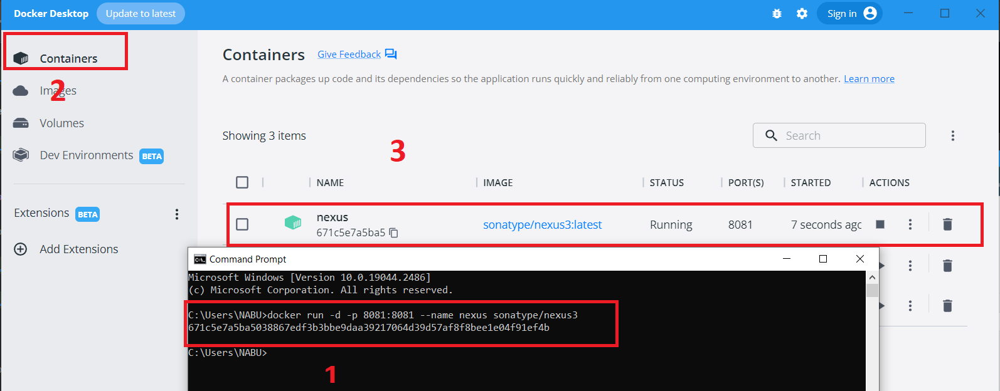

Access `http://localhost:8081/`

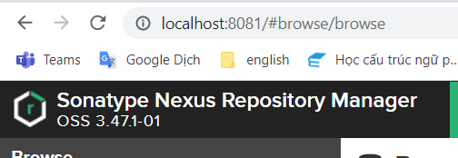

access to get password

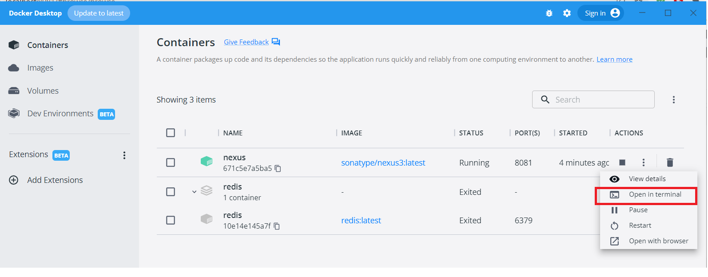

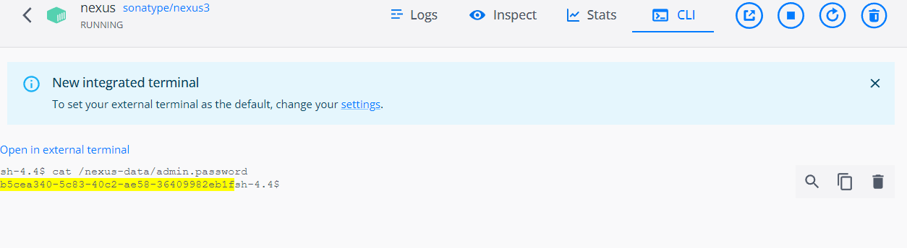

sign-in to web
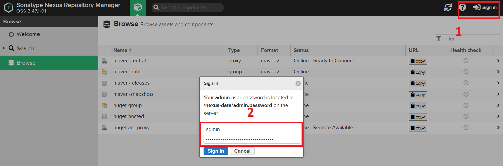

## Config to deploy jar to Nexus
Copy `settings.xml` to .m2 folder

    C:\Users\{user}\.m2

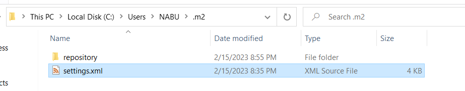

Edit file with authorization

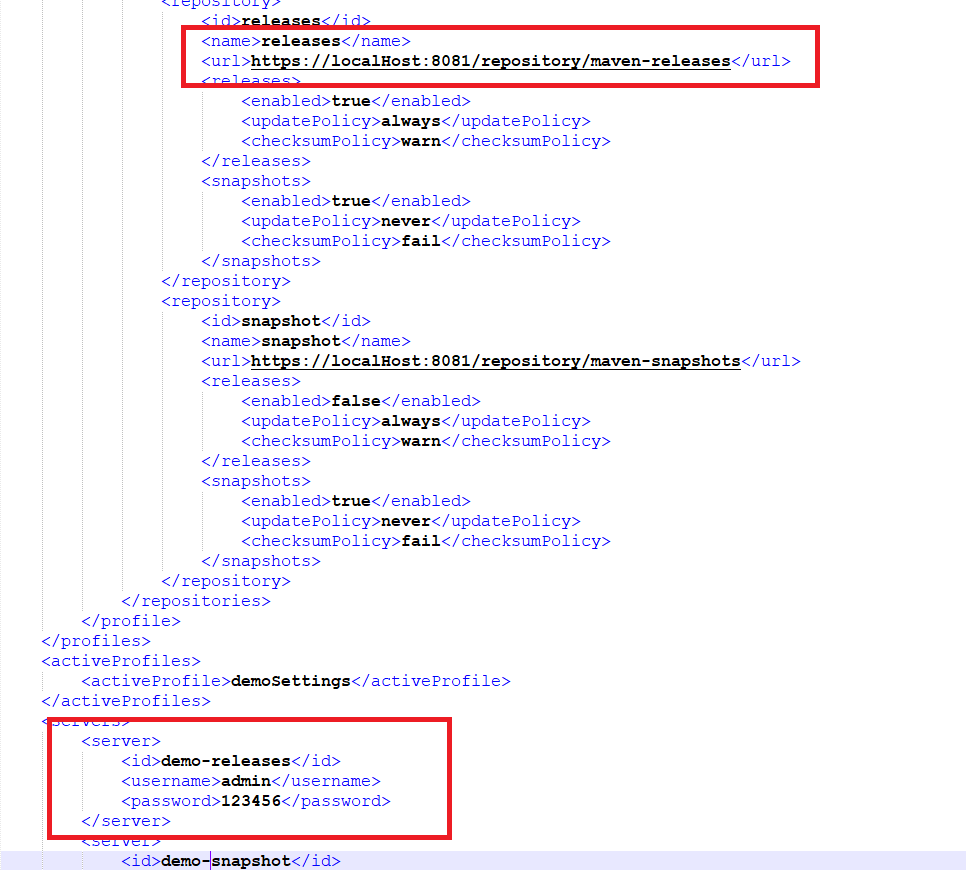

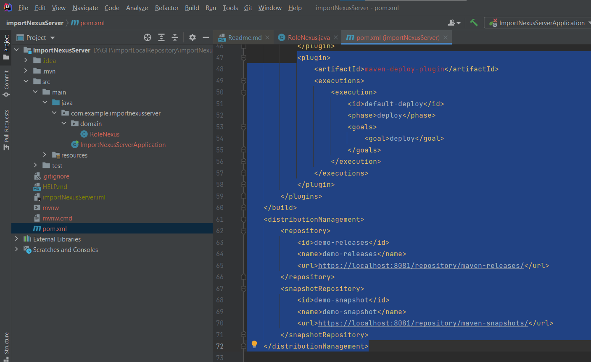

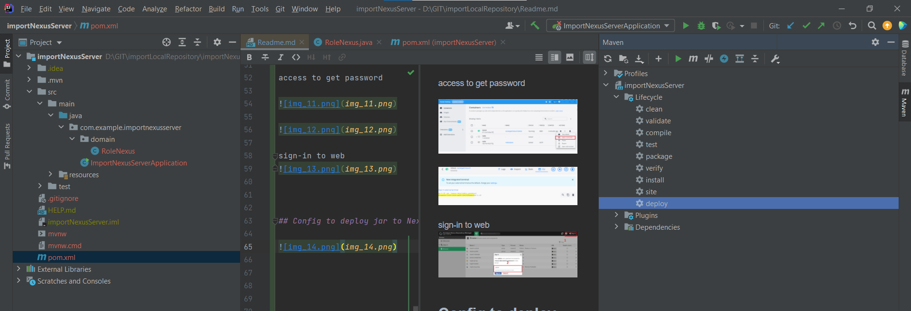

check maven on Nexus

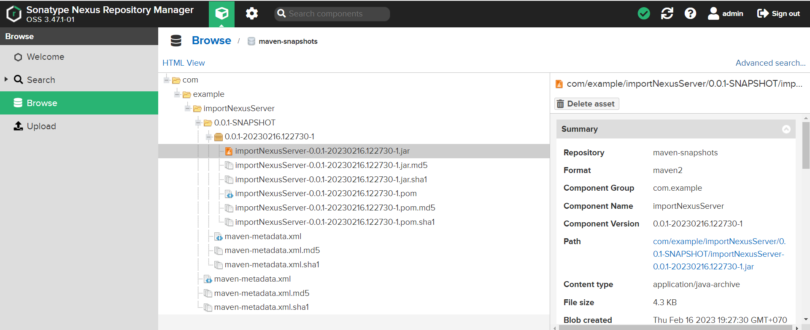

## Import to demo app

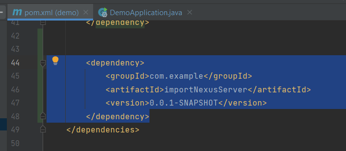

# **Result**

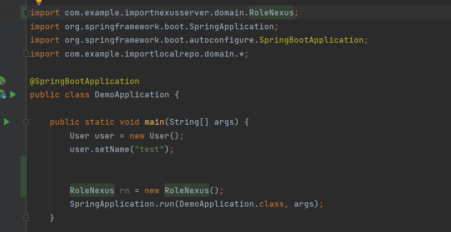

