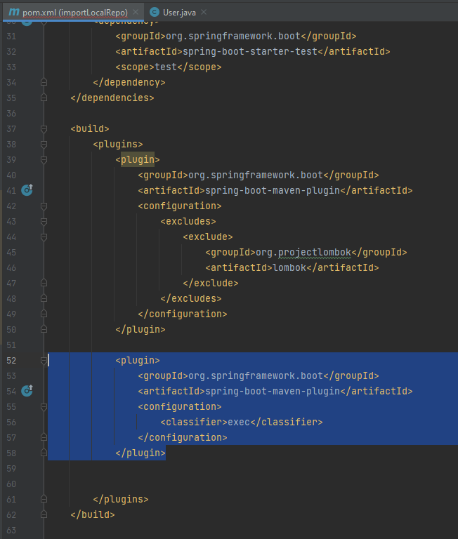
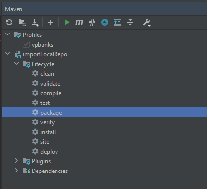
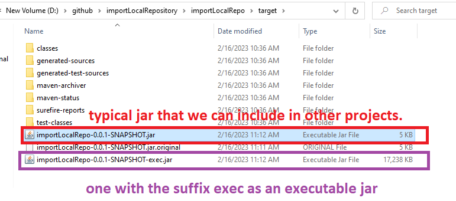
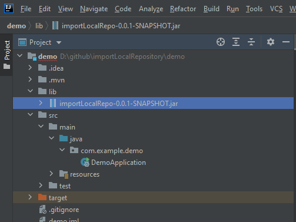
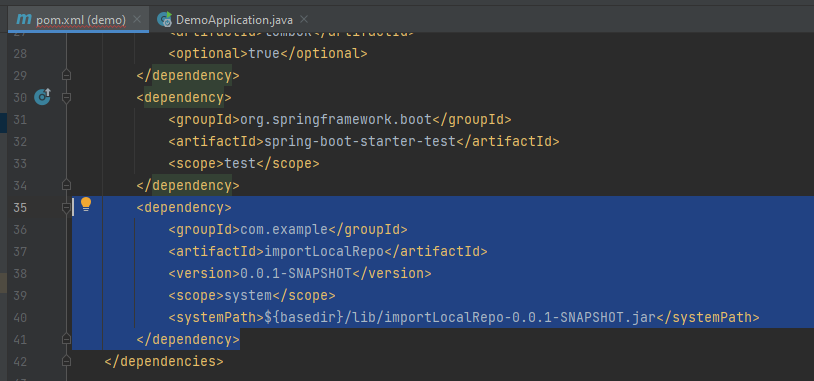
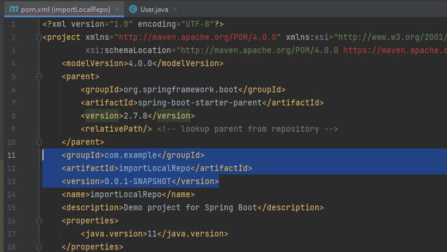
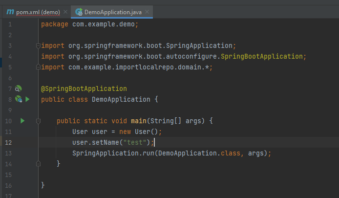

# import local repository

## create standard java library

run package to create library

the output in target folder

## import standard java library to target project

copy the lib jar file to /lib folder

config in pom to import

get groupId, artifactId, version from pom of importLocalRepo

now we can import and use package of importLocalRepo

